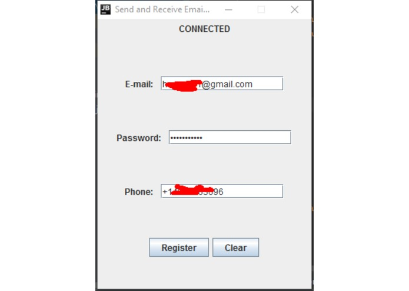

# SMSEmail

This is a project made in SD Hacks 2017. SMSEmail enables users to check, send and receive emails with SMS messages, without the use of Internet. We used Java Mail and **Twilio** API for this project.

## Inspiration

We were impressed by the Twilio demo in the opening ceremony, so we'd like to explore the Twilio API.

## What it does

It allows to send and read emails through telephone sms without necessarily having Internet available.

## How I built it

We built the the project based on a spark structure demonstrated in Twilio official website. We mainly use the post method to handle the request and response between the PC server and the telephone. We use regular expression to check validity of user command. We use ngrok to connect our PC server to a public host, so that Twilio API could handle our request.

## Challenges We ran into

The most difficult thing we met is the process of setting up. We were all new to the Twilio API, as well as spark, ngrok, and other techniques which we never used before. Setting up the environment was a big challenge for us.

## Accomplishments that We're proud of

We thought we may not finish our project since it is kind of complex, but we did! Although there are still a lot to improve, but at lease the project is completed and have the basic functions that user could utilize.

## What We learned

Some techniques such as Twilio, spark, ngrok, etc. We also have a better understanding about how to collaborate with each other.

## What's next for SmsEmail

Now we only support Gmail and the user interface in PC is kind of simple. So in the future, we will support more email servers and enhance the PC user interface.

## Built With

- [Java](https://devpost.com/software/built-with/java)
- [Twilio](https://devpost.com/software/built-with/twilio)
- ngrok

## Contributors

- Bang Du
- Xiangyi Gong
- Yue Wu
- Yiming Zhang

## TODO

Due to unfamiliarity with web servers at the time of the hackathon, we were only able to create a desktop client, which has to be connected to the Internet. I may return to this to add a complete back end. 

## Screenshots

